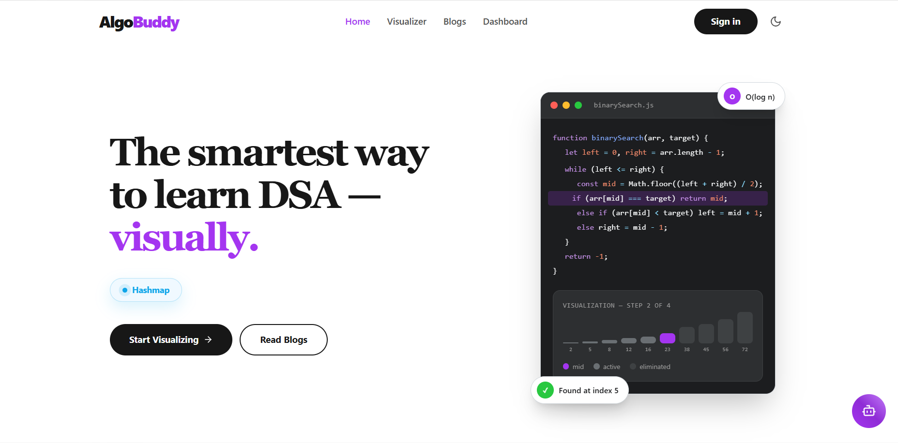
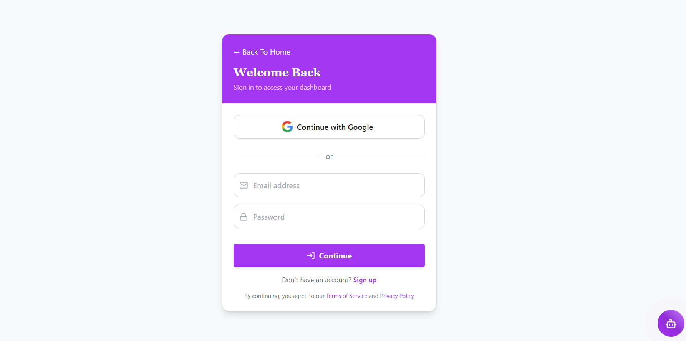
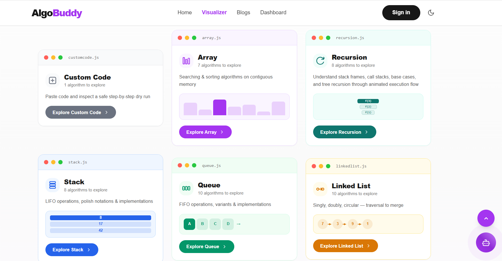
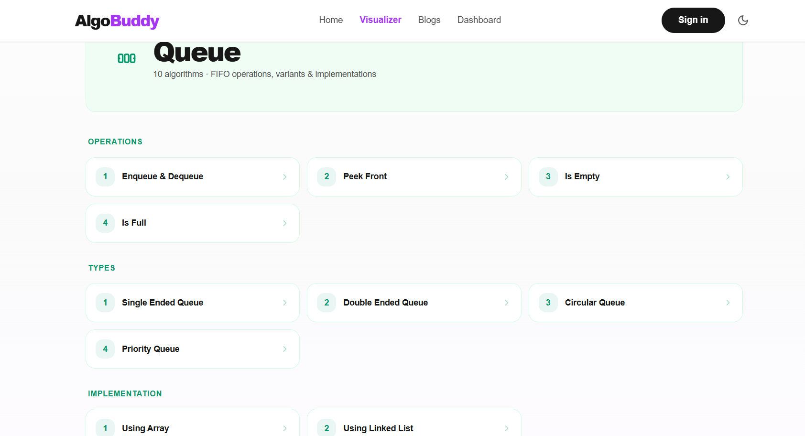
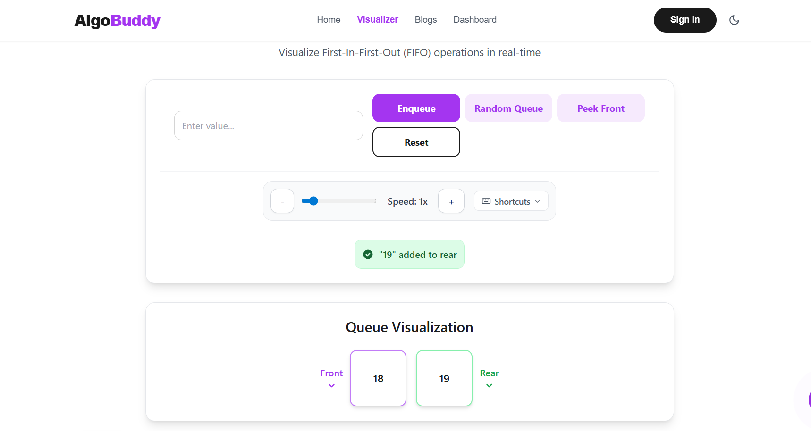
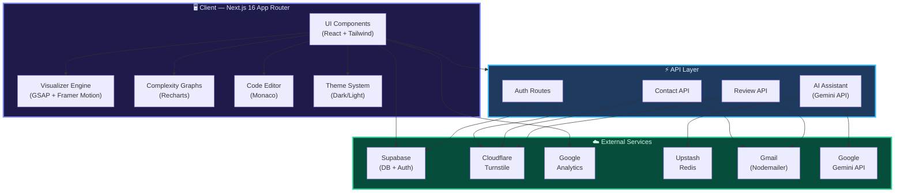

<div align="center">

<!-- Animated Header Banner -->


<br/>

[](https://algobuddy.me)
[](LICENSE)
[](https://nextjs.org/)
[](https://github.com/PankajSingh34/AlgoBuddy/stargazers)
[](https://github.com/PankajSingh34/AlgoBuddy/forks)
[](CONTRIBUTING.md)
[](https://discord.gg/Gv2N4U3KAc)

<br/>

<!-- Tagline -->
> **🧠 An open-source, interactive DSA learning platform that brings algorithms to life through step-by-step animations, structured learning paths, and progress tracking.**
>
>Built for students, developers, and interview candidates who want to <strong>see</strong> how algorithms work — not just read about them.


<!-- Quick Links -->
[**✨ Features**](#-features) · [**📷 Screenshots**](#-screenshots) · [**🛠 Tech Stack**](#-tech-stack) · [**🚀 Quick Start**](#-quick-start) · [**📁 Project Structure**](#-project-structure) · [**🤝 Contributing**](#-contributing) · [**📜 License**](#-license)

<br/>

<!-- Separator -->


</div>
## 📚 Table of Contents

- [🎯 Why AlgoBuddy?](#-why-algobuddy)
- [✨ Features](#-features)
  - [🔮 Algorithm Visualizer](#-algorithm-visualizer)
- [👤 User System & Progress Tracking](#-user-system--progress-tracking)
- [📝 Blog Platform](#-blog-platform)
- [🎨 UX & Design](#-ux--design)
- [📸 Screenshots](#-screenshots)
  - [🏠 Home Page](#-home-page)
  - [🔐 Authentication Page](#-authentication-page)
  - [🧠 Visualizer Dashboard](#-visualizer-dashboard)
  - [🔄 Queue Visualization](#-queue-visualization)
  - [📚 Queue Operations](#-queue-operations)
- [🛠 Tech Stack](#-tech-stack)
- [🏗 Architecture](#-architecture)
- [🚀 Quick Start](#-quick-start)
  - [Prerequisites](#prerequisites)
  - [1️⃣ Clone the Repository](#1️⃣-clone-the-repository)
  - [2️⃣ Install Dependencies](#2️⃣-install-dependencies)
  - [3️⃣ Configure Database Schema](#3️⃣-configure-database-schema)
  - [4️⃣ Configure Environment Variables](#4️⃣-configure-environment-variables)
  - [5️⃣ Start the Development Server](#5️⃣-start-the-development-server)
  - [6️⃣ Other Commands](#6️⃣-other-commands)
- [📁 Project Structure](#-project-structure)
- [🤝 Contributing](#-contributing)
  - [Contribution Areas](#contribution-areas)
  - [Getting Started](#getting-started)
  - [Issue Assignment Process](#issue-assignment-process)
- [💬 Community](#-community)
- [🌟 Star History](#-star-history)
- [👥 Contributors](#-contributors)
- [📜 License](#-license)

<br/>

## 🎯 Why AlgoBuddy?

> *"Tell me and I forget, teach me and I remember, involve me and I learn."* — Benjamin Franklin

Most DSA resources are walls of text and static diagrams. **AlgoBuddy changes that** by letting you interact with every data structure and algorithm in real time.

<table>
<td width="52%">

## 😫 The Problem
- Static textbooks don't show algorithm flow
- Copying code doesn't build understanding
- No feedback loop on what you've mastered
- Hard to stay motivated without visible progress

</td>
<td width="47%">

## ✅ The AlgoBuddy Way
- **Watch** algorithms execute step-by-step
- **Interact** with data structures directly
- **Track** your learning journey with streaks
- **Read** companion blogs for deeper theory

</td>
</table>

<br/>

## ✨ Features

### 🔮 Algorithm Visualizer

Animated, step-by-step visualizations for a wide range of DSA topics:

<table>
<tr>
<td align="center" width="20%">

**🔄 Sorting**
</td>
<td align="center" width="20%">

**🔍 Searching**
</td>
<td align="center" width="20%">

**📚 Stack**
</td>
<td align="center" width="20%">

**🚶 Queue**
</td>
<td align="center" width="20%">

**🔗 Linked List**
</td>
</tr>
<tr>
<td>

- Bubble Sort
- Insertion Sort
- Selection Sort
- Merge Sort
- Quick Sort

</td>
<td>

- Linear Search
- Binary Search
- Sorting Comparison Mode
- Sliding Window Technique

</td>
<td>

- Push / Pop
- Peek / isEmpty
- Polish Notation
- Array & LL impl.

</td>
<td>

- Enqueue / Dequeue
- Circular Queue
- Priority Queue
- Double-ended
- Array & LL impl.

</td>
<td>

- Singly Linked
- Doubly Linked
- Circular
- Insert / Delete
- Reverse / Merge

</td>
</tr>
</table>

<table>
<tr>
<td align="center" width="33%">

**🌳 Trees**
</td>
<td align="center" width="33%">

**#️⃣ HashMap**
</td>
<td align="center" width="34%">

**📊 Complexity Graphs**
</td>
</tr>
<tr>
<td>

- Binary Tree types
- In-order Traversal
- BST operations
- Heaps & Tries

</td>
<td>

- Insert / Search / Delete
- Collision handling
- Visual hash buckets

</td>
<td>

- Time & Space analysis
- Side-by-side comparisons
- Powered by Recharts

</td>
</tr>
</table>

<br/>

## 👤 User System & Progress Tracking

| Feature | Description |
|---|---|
| 🔐 **Auth** | Email/password with Cloudflare Turnstile captcha + Google OAuth |
| 📊 **Dashboard** | Module-level progress tracking per data structure |
| 🔥 **Streaks** | Activity heatmap (last 90 days) + daily streak counter |
| 🤖 **AI Assistant** | Built-in chatbot powered by **Gemini** for concept help |

<br/>
<br/>

## 📝 Blog Platform

| Feature | Description |
|---|---|
| 🏷 **Categories** | Filter articles by DSA topic |
| 🔎 **Full-text Search** | Instantly find relevant articles |
| ⏱ **Reading Time** | Estimated reading time on every article |
| 📖 **Rich Content** | In-depth articles on core DSA concepts |

<br/>
<br/>

## 🎨 UX & Design

| Feature | Description |
|---|---|
| 🌗 **Dark/Light Mode** | Theme toggle persisted to `localStorage` |
| 📱 **Responsive** | Optimized for mobile, tablet, and desktop |
| 🎬 **Animations** | Smooth visualizations via GSAP + Framer Motion |
| ✨ **Particle Effects** | Interactive background using tsParticles |

<br/>
<br/>

## 📸 Screenshots

### 🏠 Home Page



---

### 🔐 Authentication Page



---

### 🧠 Visualizer Dashboard



---

### 🔄 Queue Visualization



---

### 📚 Queue Operations



<br/>
<br/>

## 🛠 Tech Stack

<div align="center">

| Layer | Technology | Purpose |
|:---|:---|:---|
| ⚡ **Framework** |  | App Router, SSR, API routes |
| 🎨 **Styling** |  | Utility-first CSS framework |
| 🗄 **Database** |  | PostgreSQL + Auth + Realtime |
| 🎬 **Animation** |   | Visualizer animations |
| 📊 **Charts** |  | Complexity comparison graphs |
| ✏️ **Editor** |  | In-browser code editor |
| 📧 **Email** |  | Transactional emails via Gmail |
| 🛡 **Captcha** |  | Bot protection on auth |
| 📈 **Analytics** |  | Usage tracking |
| ⏱ **Rate Limiting** |  | API rate limiting |
| 🚀 **Deployment** |  | Serverless hosting |
| 🔁 **CI/CD** |  | Multi-OS testing pipeline |

</div>

<br/>

## 🏗 Architecture



<br/>

## 🚀 Quick Start

### Prerequisites

| Tool | Version |
|---|---|
| **Node.js** | `>= 20.x` |
| **npm** | `>= 10.x` |
| **Git** | Latest |

### 1️⃣ Clone the Repository

```bash
git clone https://github.com/PankajSingh34/AlgoBuddy.git
cd AlgoBuddy
```

### 2️⃣ Install Dependencies

```bash
npm install
```

> **⚠️ Note:** This project uses `isolated-vm` for secure code execution. If you encounter build errors, ensure you have Python and a C++ compiler installed (required for native addon compilation).

### 3️⃣ Configure Database Schema

Run the following SQL in the Supabase SQL Editor to enable user progress tracking and avatar storage:

```sql
create extension if not exists "pgcrypto";

create table if not exists public.user_progress (
  id uuid primary key default gen_random_uuid(),

  user_id uuid not null references auth.users(id) on delete cascade,

  module_id text not null,

  is_done boolean default false,

  created_at timestamptz default now(),

  updated_at timestamptz default now(),

  unique(user_id, module_id)
);

alter table public.user_progress enable row level security;

create policy "Users can read own progress"
on public.user_progress
for select
using (auth.uid() = user_id);

create policy "Users can insert own progress"
on public.user_progress
for insert
with check (auth.uid() = user_id);

create policy "Users can update own progress"
on public.user_progress
for update
using (auth.uid() = user_id);


-- Avatar / profile table
create table if not exists public.user_profiles (
  id uuid primary key default gen_random_uuid(),

  user_id uuid not null references auth.users(id) on delete cascade unique,

  avatar_url text,

  created_at timestamptz default now(),

  updated_at timestamptz default now()
);

alter table public.user_profiles enable row level security;

create policy "Users can read own profile"
on public.user_profiles
for select
using (auth.uid() = user_id);

create policy "Users can insert own profile"
on public.user_profiles
for insert
with check (auth.uid() = user_id);

create policy "Users can update own profile"
on public.user_profiles
for update
using (auth.uid() = user_id);
```

These tables are required for:

* Module completion tracking
* Profile progress updates
* Avatar profile data
* Learning streak features

> Note: Without these tables, progress tracking, avatars, and streak features will not work locally.

### 4️⃣ Configure Environment Variables

Create a `.env.local` file in the project root:

```env
# ──────────── Email ────────────
EMAIL_USER=your-email@gmail.com
EMAIL_PASSWORD=your-google-app-password
REVIEW_INBOX_EMAIL=optional-inbox@gmail.com

# ──────────── Supabase ────────────
NEXT_PUBLIC_SUPABASE_URL=https://your-project.supabase.co
NEXT_PUBLIC_SUPABASE_ANON_KEY=your-supabase-anon-key
SUPABASE_SERVICE_KEY=your-supabase-service-key

# ──────────── Cloudflare Turnstile ────────────
NEXT_PUBLIC_TURNSTILE_SITE_KEY=your-turnstile-site-key
TURNSTILE_SECRET_KEY=your-turnstile-secret-key

# ──────────── Google Analytics ────────────
NEXT_PUBLIC_GA_ID=G-XXXXXXXXXX

# ──────────── AI Chatbot ────────────
GEMINI_API_KEY=your-gemini-api-key

# ──────────── Rate Limiting (Production) ────────────
UPSTASH_REDIS_REST_URL=your-upstash-url
UPSTASH_REDIS_REST_TOKEN=your-upstash-token

# ──────────── Spring Boot Backend CORS (Optional in dev, required in prod) ────────────
ALLOWED_ORIGINS=http://localhost:3000
APP_ENV=dev
```

> **💡 Tip:** See [`.env.example`](.env.example) for a complete reference of all environment variables.

### 5️⃣ Start the Development Server

```bash
npm run dev
```

Open **[http://localhost:3000](http://localhost:3000)** and start visualizing! 🎉

### 6️⃣ Other Commands

```bash
npm run build          # Production build
npm run start          # Start production server
npm run lint           # Run ESLint
npm run test           # Run lint + security tests
npm run test:security  # Run XSS security tests only
```

<br/>
<br/>

## 📁 Project Structure

```
AlgoBuddy/
│
├── 📂 app/                          # Next.js App Router
│   ├── 📂 api/                      # API routes
│   │   ├── auth/                    #   ├── Authentication endpoints
│   │   ├── contact/                 #   ├── Contact form handler
│   │   ├── chatbot/                 #   ├── AI chatbot endpoint
│   │   └── send-review/             #   └── Review submission
│   │
│   ├── 📂 dashboard/                # User dashboard
│   ├── 📂 login/                    # Auth pages
│   ├── 📂 visualizer/               # Algorithm visualizer pages
│   │
│   ├── 📂 components/               # Shared UI components
│   │   ├── dashboard/               #   ├── Heatmap, streaks
│   │   ├── models/                  #   ├── Data structure models
│   │   └── ui/                      #   └── Reusable UI primitives
│   │
│   ├── layout.jsx                   # Root layout
│   └── page.jsx                     # Landing page
│
├── 📂 lib/                          # Utility libraries
│   ├── supabase.js                  #   ├── Supabase client config
│   ├── activity.js                  #   ├── Activity tracking logic
│   └── gtag.js                      #   └── Google Analytics helper
│
├── 📂 utils/                        # Helper functions
├── 📂 public/                       # Static assets
├── 📂 docs/                         # Documentation
├── 📂 security-tests/               # Security test suite
├── 📂 .github/                      # GitHub Actions workflows
│
├── middleware.js                     # Next.js middleware (auth, rate limiting)
├── tailwind.config.js                # Tailwind configuration
├── next.config.mjs                   # Next.js configuration
├── eslint.config.mjs                 # ESLint configuration
├── package.json                      # Dependencies & scripts
└── next-sitemap.config.js            # SEO sitemap generation
```

<br/>

## 🤝 Contributing

We 💜 contributions! AlgoBuddy is built by the community, for the community.

### Contribution Areas

| Area | What you can do |
|---|---|
| 🐛 **Bug Fixes** | Squash bugs and resolve issues |
| 🎨 **UI/UX** | Improve responsiveness, accessibility, design |
| 🔮 **New Visualizers** | Add new DSA visualizers & animations |
| 📖 **Documentation** | Improve guides, README, contributor docs |
| ⚡ **Performance** | Optimize app performance & efficiency |
| 🌗 **Themes** | Enhance dark/light mode experience |

### Getting Started

```bash
# 1. Fork this repo and clone your fork
git clone https://github.com/YOUR_USERNAME/AlgoBuddy.git

# 2. Create a feature branch
git checkout -b feature/your-feature-name

# 3. Make your changes and commit
git commit -m "feat: describe your change"

# 4. Push and open a PR
git push origin feature/your-feature-name
```

> 📖 For detailed guidelines, please read our [**Contributing Guide**](CONTRIBUTING.md) and [**Code of Conduct**](CODE_OF_CONDUCT.md).

### Issue Assignment Process

1. 🔍 Browse [**open issues**](https://github.com/PankajSingh34/AlgoBuddy/issues) or create a new one
2. 💬 Comment asking to be assigned
3. ⏳ Wait for maintainer assignment before starting
4. 🔀 Submit a PR referencing the issue number

<br/>

## 💬 Community

<div align="center">

[](https://discord.gg/Gv2N4U3KAc)

Ask questions, share ideas, show off your contributions, and connect with fellow learners!

</div>

<br/>

## 🌟 Star History

<div align="center">

If AlgoBuddy helped you learn, please consider giving it a ⭐ — it means a lot!

[](https://star-history.com/#PankajSingh34/AlgoBuddy&Date)

</div>

<br/>

## 👥 Contributors

<div align="center">

<a href="https://github.com/PankajSingh34/AlgoBuddy/graphs/contributors">
  
</a>

</div>

<br/>

## 📜 License

<div align="center">

This project is licensed under the **MIT License** — see the [**LICENSE**](LICENSE) file for details.

</div>

<br/>

---

<div align="center">


<strong>Built with 💜 by the AlgoBuddy community</strong>

<br/>

[🌐 Website](https://www.algobuddy.me/) · [📢 Discord](https://discord.gg/Gv2N4U3KAc) · [🐛 Issues](https://github.com/PankajSingh34/AlgoBuddy/issues) · [🔀 Pull Requests](https://github.com/PankajSingh34/AlgoBuddy/pulls)

</div>
